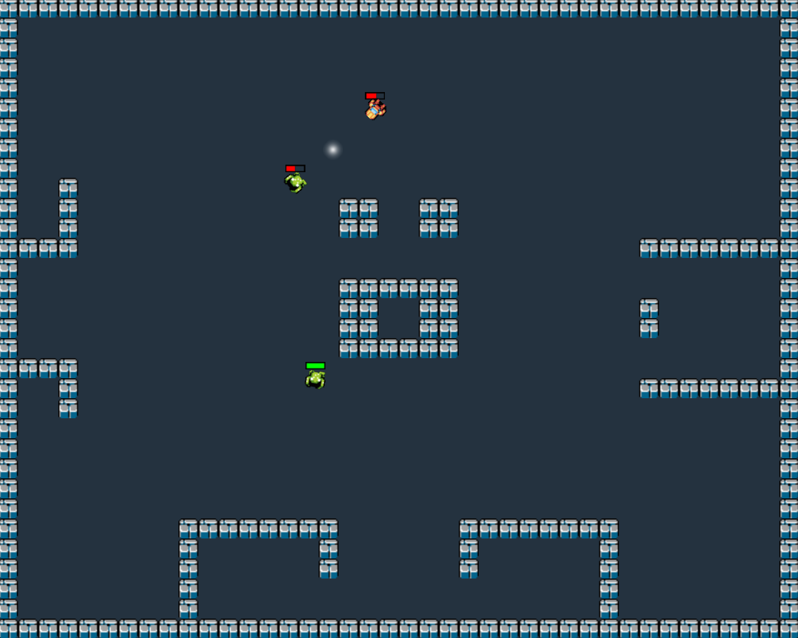

event_game
==========

Event based game I wrote to learn Ruby

The main goal of this project is to write a generic event based library for my own use.
The implemented game is still quite simple, but it demonstrates how you could write a event based game.

I basically wrote this with only ruby's documentation and I haven't done much event based programming before (aside from some simple GUI stuff). Please do comment if you have an idea how this game could be further improved.

Installation:

On OSX:

1. open Terminal  
2. $gem install gosu  

On Linux (not tested):  
go to http://www.libgosu.org and read up to date instructions  

To launch the game:  
Option 1:  
1. navigate to the event_game_master folder in Terminal  
2. $ruby ./main.rb  
Option 2:  
1. navigate to the event_game_master folder in Terminal  
2. $chmod +x main.rb  
3. $./main.rb  
